# DADP dashboard — ideas-mining

Generated by `tools/dadp_report.py` from `.agent/ledger.jsonl` (103 events) and `.agent/handoff.json`. **Do not hand-edit** — it is regenerated at every session end and any manual change is lost.

Cycle **5** · turn **codex** · status **READY_FOR_VALIDATION** · router last updated `2026-08-01T18:01:06Z`.

---

## 1. Open right now

4 unresolved item(s) as of cycle 5 (`turn: codex`, `status: READY_FOR_VALIDATION`).

| id | severity | needs | since cycle | cycles open | target | addressed by | state |
|---|---|---|---|---|---|---|---|
| `OQ-6` | BLOCKER | **human** | 0 | 5 | .spec/system_spec.md | — | re-raised every cycle since — FINDING-0.3, FINDING-1.10, FINDING-2.15, FINDING-3.11, FINDING-4.7 |
| `FINDING-4.4` | FAILED | **builder** | 4 | 1 | ideas_mining/digest.py | DECISION-5.1 | fix landed, awaiting re-validation |
| `FINDING-4.5` | FAILED | **builder** | 4 | 1 | migrations/deferred/0002_hnsw_indexes.py | DECISION-5.3 | fix landed, awaiting re-validation |
| `FINDING-4.6` | FAILED | **builder** | 4 | 1 | migrations/env.py | DECISION-5.4 | fix landed, awaiting re-validation |

- **OQ-6** — Manual LLM and digest quality criteria have no assertion form: pain-point normalization, vertical disagreements, and digest usefulness need a human reading real model output. The pipeline has still never run against real data, so these cannot be exercised yet
- **FINDING-4.4** — Two plain-text Strongest quote entries with one aggregate URL are accepted because per-quote enforcement only recognizes Markdown blockquotes
- **FINDING-4.5** — IF NOT EXISTS accepts an existing wrong-opclass or invalid HNSW index and Alembic still records revision 0002
- **FINDING-4.6** — After opt-in, default alembic downgrade base exits 0 without changing the revision or removing any schema because the early return is not scoped to upgrade

---

## 2. Finding lifecycle chains

Each component below is one thread of cause and effect: a finding, the decision taken against it, and what the next validation found. A chain that keeps growing is a bug that is circling; a chain ending green has converged. Edges are derived from `traces_to` in the ledger — `INV-*` references are excluded here because they connect everything (see section 3).

Legend: green = resolved, red = still open, grey = a Builder decision.

### DECISION-2.8 … DECISION-5.4 — OPEN

Longest chain (7 steps): `DECISION-2.8 → FINDING-2.5 → DECISION-3.2 → FINDING-3.3 → DECISION-4.1 → FINDING-4.6 → DECISION-5.4`

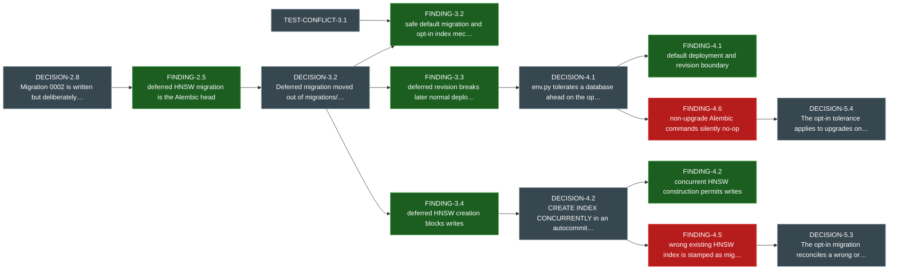

### FINDING-2.6 … DECISION-5.1 — OPEN

Longest chain (6 steps): `FINDING-2.6 → DECISION-3.3 → FINDING-3.5 → DECISION-4.3 → FINDING-4.4 → DECISION-5.1`

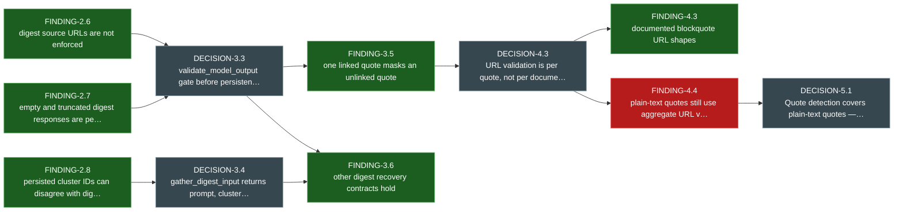

### OQ-6 … FINDING-0.3 — OPEN

Longest chain (2 steps): `OQ-6 → FINDING-0.3`

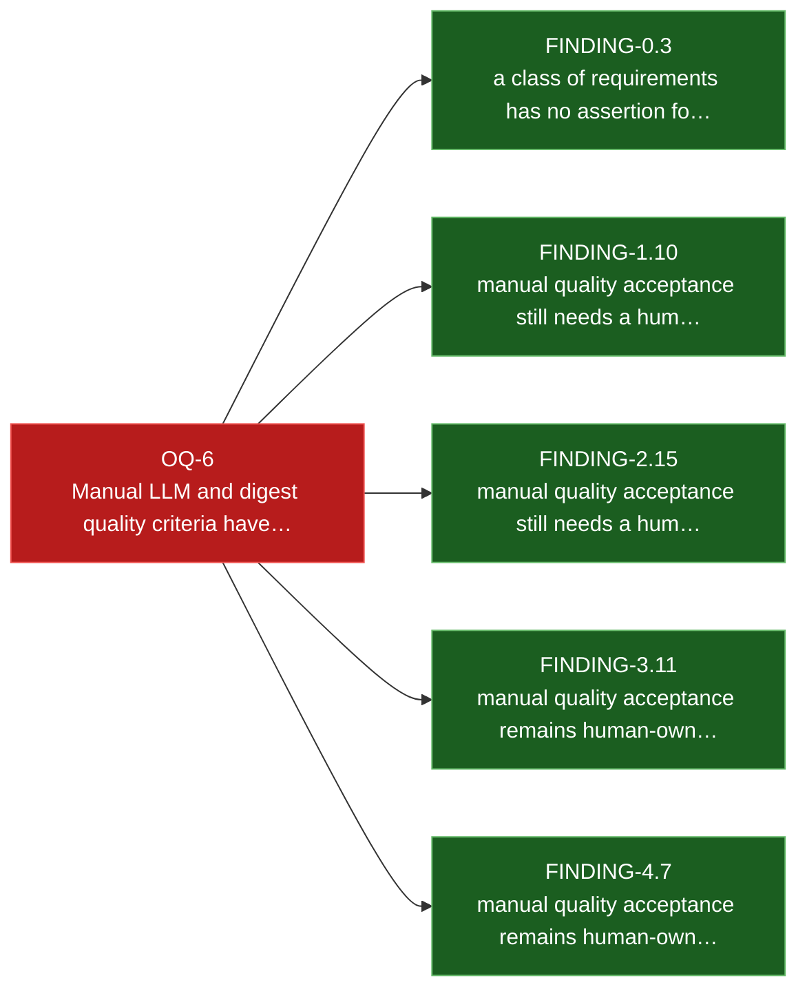

### OQ-2 … FINDING-3.10 — closed

Longest chain (5 steps): `OQ-2 → DECISION-2.10 → FINDING-2.13 → DECISION-3.9 → FINDING-3.10`

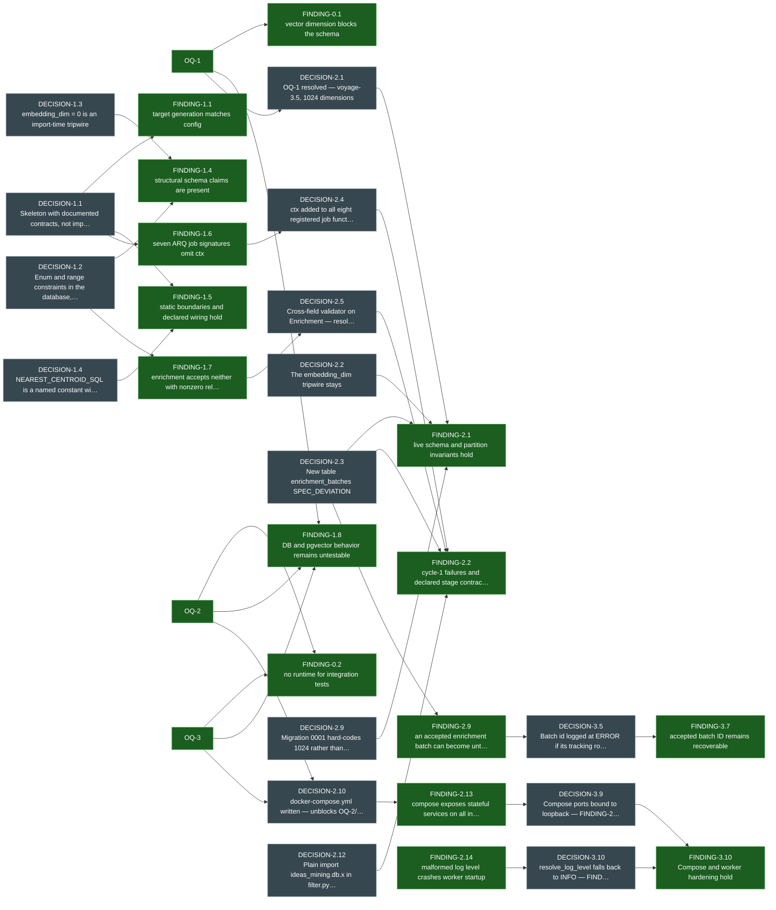

### DECISION-1.7 … FINDING-3.1 — closed

Longest chain (6 steps): `DECISION-1.7 → FINDING-1.9 → DECISION-2.11 → FINDING-2.4 → DECISION-3.1 → FINDING-3.1`

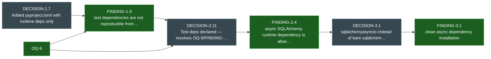

### FINDING-2.10 … FINDING-3.8 — closed

Longest chain (3 steps): `FINDING-2.10 → DECISION-3.7 → FINDING-3.8`

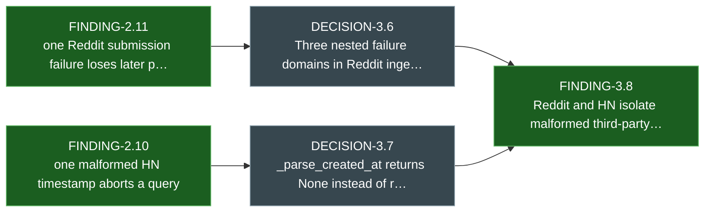

### OQ-7 … FINDING-0.4 — closed

Longest chain (2 steps): `OQ-7 → FINDING-0.4`

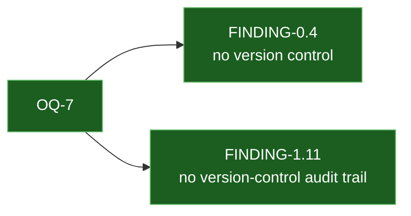

### FINDING-2.12 … FINDING-3.9 — closed

Longest chain (3 steps): `FINDING-2.12 → DECISION-3.8 → FINDING-3.9`

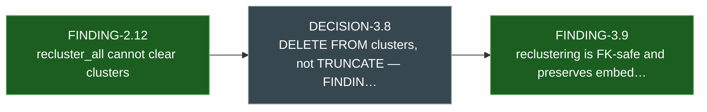

### DECISION-1.6 … FINDING-1.2 — closed

Longest chain (2 steps): `DECISION-1.6 → FINDING-1.2`

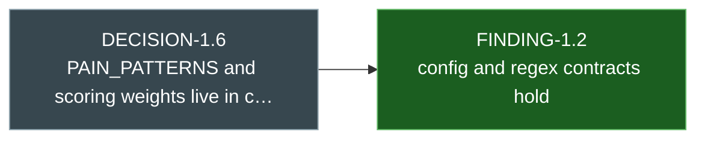

### DECISION-1.5 … FINDING-1.3 — closed

Longest chain (2 steps): `DECISION-1.5 → FINDING-1.3`

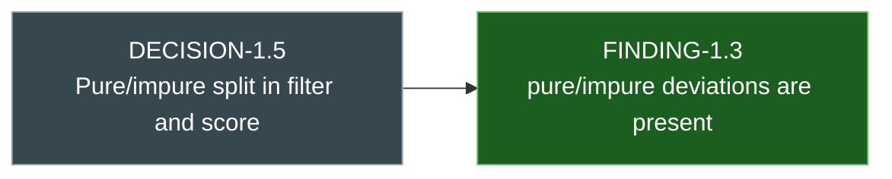

### DECISION-2.6 … FINDING-2.3 — closed

Longest chain (2 steps): `DECISION-2.6 → FINDING-2.3`

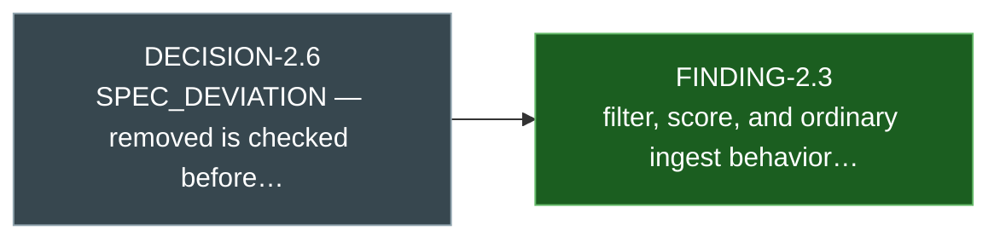

**6 event(s) are in no chain at all** — nothing traces to them and they trace to nothing but invariants, so they are invisible to this graph: `DECISION-0.1`, `DECISION-0.2`, `DECISION-0.3`, `DECISION-0.4`, `DECISION-2.7`, `DECISION-5.2`.

---

## 3. Invariant coverage

How often each system invariant was **asserted** by the Builder (a ticked box in *Invariants Verified*), **referenced** in a Builder decision, **traced** by a Validator finding, and — the column that matters — actually **confirmed by a `PASSED` finding**.

| invariant | asserted | referenced | traced | PASSED | signal |
|---|---|---|---|---|---|
| `INV-1` — One cluster = one distinct pain, in one vertical | 0 | 0 | 4 | 0 | **never confirmed by a PASSED finding**, never asserted by the Builder |
| `INV-2` — Cluster assignment never crosses verticals | 2 | 2 | 5 | 3 | 1× partial |
| `INV-3` — Ingest is idempotent | 2 | 0 | 7 | 5 | — |
| `INV-4` — The LLM never sees a post twice | 2 | 0 | 2 | 2 | — |
| `INV-5` — Every stage is resumable | 3 | 0 | 24 | 9 | — |
| `INV-6` — Only pain_point is embedded | 2 | 0 | 2 | 2 | — |
| `INV-7` — frequency counts distinct authors, not posts | 2 | 2 | 2 | 2 | — |
| `INV-8` — A post belongs to exactly one cluster | 0 | 0 | 1 | 1 | **thin coverage**, never asserted by the Builder |
| `INV-9` — Ranking is within-vertical | 2 | 0 | 2 | 2 | — |
| `INV-10` — Every digest quote carries its source URL | 3 | 2 | 11 | 2 | — |
| `INV-11` — A digest is persisted before delivery is attempted | 2 | 0 | 2 | 1 | — |

**Coverage gaps worth acting on:**

- `INV-1` (One cluster = one distinct pain, in one vertical) — no `PASSED` finding has ever confirmed it.
- `INV-8` (A post belongs to exactly one cluster) — traced by only 1 finding across all cycles.

---

## 4. Cycle health

Rendered as a table rather than a Mermaid `xychart-beta`: xychart is a newer Mermaid block whose availability depends on which Mermaid version the Markdown preview bundles, and a chart that silently fails to render is worse than a table that always does. `flowchart` in section 2 is core Mermaid and has no such caveat.

| cycle | decisions | deviations | findings P/F/B | suite passed | suite failed | still open | trend |
|---|---|---|---|---|---|---|---|
| 0 | 4 | — | 0/0/4 | — | — | — | `░░░░` |
| 1 | 7 | 2 | 5/2/4 | 32 | 2 | — | `██░░░░` |
| 2 | 12 | 3 | 3/11/1 | 70 | 14 | — | `███████████░` |
| 3 | 10 | — | 7/3/1 | 99 | 3 | — | `███░` |
| 4 | 3 | — | 3/3/1 | 109 | 3 | 3 | `███░` |
| 5 | 4 | — | 0/0/0 | 112 *(builder run)* | 0 | — | `·` |

`still open` counts findings raised in that cycle that no later `PASSED` finding has yet closed. Bars: █ = FAILED, ░ = BLOCKER.
